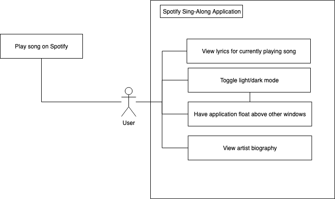

# spotify-sing-along
Lyrics app for Spotify Desktop

## Project Abstract
I would like to create an open-source application for desktop that is connected with Spotify that automatically detects what song is currently being played and provides the lyrics for that song. There will be a small external window that appears that presents the lyrics in a scrolling fashion in time with the song, and there will be an option to have the window float above all other windows so that the lyrics will be visible no matter what the user is doing on his or her computer. There could also potentially be other features within the application which provide biographical information about the artist, or even provide the lyric annotations that are featured on lyric websites like Genius.

## Project Relevance
This project would be linked to several of the educational goals of this course. Creating a new open-source project from scratch would greatly benefit from test-driven development, especially in the beginning stages where everything should be validated for correctness. This project would also definitely require debugging. As a whole, the setup of multiple features within the application would be well-suited for object-oriented design, and of course in a group environment the project would greatly benefit from project management and version control so that each member could work on different features at the same time. This project will also require the creation of a graphical user interface and require coordination of frontend and backend development. Ultimately, each of these goals are important and relevant to getting practice with the software development lifecycle and gaining experience programming in environments similar to the real world.

## Conceptual Design
A general framework of my project would be to create an application that connects with the Spotify API using a Spotify Web API Java Wrapper so that it could get the information about the current song that is being played by a Spotify account, as well as information about the timestamps of the song and the name of the artist. This project’s backend will use Java. The frontend/GUI will be created using the Java Swing package. Because this project is dependent on private individual user credentials, I will also have to set up environmental variables as a way to handle multiple users of the same app, as well as maintaining privacy of secrets.

## Background
Link to the project: <https://github.com/linlioechsle/spotify-sing-along>

***Building***
- Clone into your IDE (IntelliJ is ideal). You must have JDK 16.
- I have already set up the Maven dependency for the Spotify Web API Java wrapper, so once you clone the project you should be able to use the wrapper's commands and add your Spotify account credentials.
- In order to get your Spotify developer credentials to connect your account, visit <https://developer.spotify.com/dashboard/login> and log in. From there, you will have to create a new app (you can call it whatever you want, I named mine "test").
- When you have created your new app, clicking on it will take you to a page where you will be able to find your Client ID and Client Secret.
- At this point, your local project should be connected with Spotify's developer site.

## Required Resources
- Spotify Java Wrapper: <https://github.com/spotify-web-api-java/spotify-web-api-java>
- You will need a Premium Spotify account in order to have full access and capability for testing this project. You will also need to connect your account with the Spotify Developer website.
